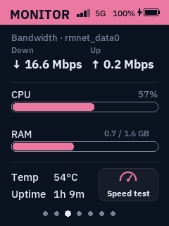
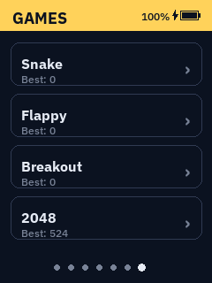
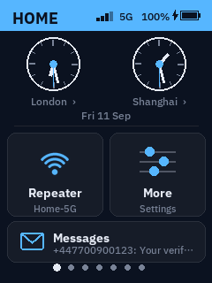
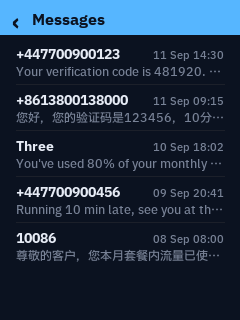
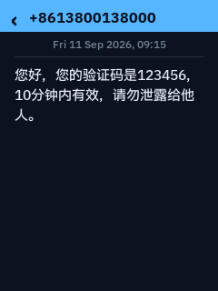
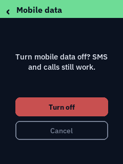
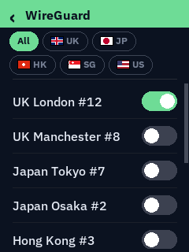
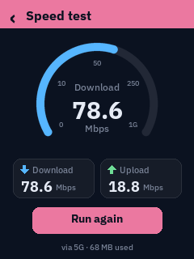
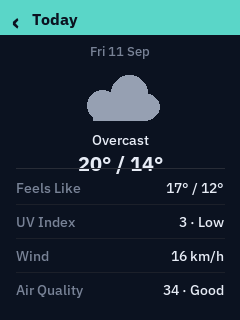
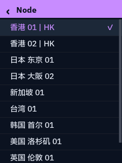

# GL-E5800 Touch Dashboard

A custom, fully interactive replacement for the stock `gl_screen` UI on the
GL.iNet GL-E5800's built-in 240x320 touchscreen. Swipe between seven panels,
tap into any of them for detail or control, and manage the router without
ever opening the web UI.


No image assets, no external UI framework — every icon, chart, and widget
is drawn at runtime with Pillow directly onto the framebuffer (`/dev/fb0`,
RGB565). Pure Python, one file.

## Panels

| Home | Active SIM | Monitor |
|---|---|---|
|  |  |  |

| Weather | Currency | OpenClash |
|---|---|---|
|  |  |  |

| Games |
|---|
|  |

**Home** — two small clocks (independently pickable cities/timezones,
digital by default, switchable to analog from More), today's date, and
three tiles: **Repeater**, **More**, and **Messages** (below the other
two), so you never need the stock GL.iNet home page.

| Digital (default) | Analog |
|---|---|
|  |  |

**Messages** (from the Home tile) — the router's built-in SMS receiver
(`smsd`/smstools3, already running against the modem) writes each
message to a plain-text spool file; this reads them (read-only, never
moves or deletes a file, so it can't interfere with any other consumer
of that spool) into a scrollable inbox list — sender + preview snippet
per row, tap for the full message. Renders in the device's bundled CJK
font so Chinese messages display correctly rather than as boxes — this
needed a real fix, not just a font swap: `smstools3` writes non-ASCII
message bodies as **raw UTF-16BE bytes** (`Alphabet: UCS2` in the file's
header), not UTF-8 text, confirmed against a real received message.

| Messages | Message detail |
|---|---|
|  |  |

*(Numbers and message content above are synthetic/demo data.)*

**Active SIM** — country flag, number, and a live cellular status card:
network type in phone terms (**4G / 4G+ / 5G NSA / 5G SA**), signal bars
and primary-carrier RSRP, and the serving carrier's name. Under the SIM1 /
eSIM switch, a row of chips shows **every band the modem is connected on
right now** — primary carrier filled, secondaries outlined, 5G NR bands
in blue — with a carrier-aggregation summary (e.g. *5 bands · 160 MHz*).
Three toggles: **Net** (network registration — off is airplane mode),
**Data** (the cellular data session) and **Roam** (data roaming for this
SIM), plus a data-usage bar against a cap you set (500 MB up to 1000 GB)
and a **WireGuard** button. (SIM2 was removed from the switch: it and eSIM
share the same physical slot on this hardware and behaved identically.)

| Active SIM | Toggle confirmation |
|---|---|
|  |  |

Every toggle **asks for confirmation first** (each one can cut the
router's internet or run up a roaming bill), then applies under a spinner
that polls the *real* state — registration, the `modem_cpu` interface,
the stored roaming setting — until it matches, with a live caption
("Registering… 12s"). If the change doesn't take (e.g. the router's own
multi-WAN manager reverts a manual cellular change), the toggle shows the
real state and a short notice says why, instead of pretending it worked.

**WireGuard** — lists every peer config on the router (GL.iNet stores each
as its own `wireguard.peer_NNNN` UCI section — hundreds of them if you've
imported a provider's server list), with country quick-filter chips and a
toggle per peer. Connecting goes through GL.iNet's own AutoVPN
route-policy rule + `vpn-client` service — the same path the stock app
uses, confirmed by diffing the config before and after connecting from the
app. The spinner waits until the tunnel is actually up.



*(Peer names above are synthetic/demo data.)*

Every panel's colored header also shows, phone-status-bar style: cellular
signal bars + radio tech (4G/4G+/5G), the active WAN connection type
(Repeater/Ethernet/4G/5G), and **battery level with a charging bolt**
(read from the fuel gauge in `/sys/class/power_supply`). When a long
panel title leaves too little room, the least important items drop out
first (the %, then the tech label, then the bars).

**Monitor** — bandwidth (down/up Mbps on whichever interface currently holds
the default route, so it keeps tracking the right link through a WAN
failover), CPU%, RAM used/total, SoC temperature, and uptime, refreshed
every 2 seconds — plus a **Speed test** button.

**Speed test** (from Monitor) — a short download + upload test against
Cloudflare's speed-test servers: 4 parallel streams, ~6s each way, the
first second of each excluded (TCP ramp-up), with a live gauge in Mbps.
Throughput is counted from the test's own streams, not the WAN
interface's counters — those include every LAN client's traffic too.
Capped at 250 MB down / 80 MB up so a fast 5G link can't burn unlimited
mobile data, and the screen shows how much it used. Leaving the screen
cancels a running test.

| Monitor | Speed test |
|---|---|
|  |  |

**Games** — Snake, Flappy, Breakout and 2048, with best scores kept
across restarts.

**Weather** — 3-day forecast (hand-drawn icons: sun/cloud/rain/snow/fog/storm)
for a city you pick from an alphabetically-sorted, scrollable list of 40+
cities, plus a manual **Update Now** button. Tap any of the three days
(today/tomorrow/day after — all three, so it never feels like only "today"
is interactive) for a detail screen: feels-like temperature, UV index
(with category), wind speed, and air quality (US AQI + category, via
Open-Meteo's separate air-quality API) — showing "No data yet" instead of
a wrong or blank value wherever a field genuinely isn't available.



**Currency** — two rows, each `1 {from} = {rate} {to}`, with `from` and
`to` independently pickable from a 10-currency list (not fixed to any one
target currency), plus a real historical line chart per row (week/month/
year, pulled from [Frankfurter](https://frankfurter.dev), ECB reference
rates).

**OpenClash** — on/off, Global/Rule mode, current node (flag + guessed
country from the node name, including common Chinese keywords like 香港/
日本/新加坡) with a tap-to-switch, scrollable node list, session traffic,
and an **Update Subscription** button (runs the same script LuCI's own
subscription page does — re-fetches every configured subscription,
reloads if changed) — all read from Mihomo's local REST API. Node names
render in the device's bundled CJK font, so Chinese subscription/node
names (common with 机场-style providers) display correctly instead of
boxes. Gracefully shows "not installed" instead of breaking if OpenClash
isn't on the device.



*(Node names above are synthetic/demo data — not a real subscription.)*

| Repeater | More | On-screen keyboard |
|---|---|---|
|  |  |  |

**Repeater** (from the Home tile) — scans and lists nearby WiFi as a real
scrollable list, connects to open networks directly or opens the
on-screen keyboard for a password. Uses the same `ubus` `repeater` object
the stock GL.iNet UI uses. Reconnecting to a previously-connected network
doesn't ask for the password again — `remember: true` on connect already
persists credentials to `/etc/config/repeater`; the UI checks there first
before falling back to the keyboard. Connecting shows a spinner ("Connecting…
SSID") that polls the real connection state in the background and clears
itself once actually associated (or after a 20s timeout), instead of the
screen just sitting there with no feedback while the handshake happens.

**More** (from the Home tile) — a 2.4GHz toggle and a 5GHz/6GHz three-way
switch (5G / Off / 6G — this hardware shares one antenna path between the
5G and 6G radios, so only one can be active). Both go through GL.iNet's
own Wi-Fi RPC, the same call the web UI's switches make, so the web page
and stock screen always agree with what you set here. If the repeater is
connected, whichever band conflicts with its upstream AP's band is grayed
out and untappable, with a "Matches repeater band" note, instead of
letting you pick a combination that can't work. Also: an Analog/Digital
clock-style switch, a **Return to Stock UI** button (confirm-gated,
same as the power-button hold gesture but more discoverable), and
confirm-gated **Reboot** and **Shutdown** buttons side by side.

**On-screen keyboard** — built because this screen has no physical or
pop-up keyboard. Two layers (letters/symbols), persistent caps toggle.

## Interaction

- **Swipe** left/right between the 7 main panels — real finger-tracking,
  then a velocity-aware snap: a page commits on either enough travel (30%
  of the width) *or* enough release speed, so a quick flick pages instead
  of springing back. The settle animation takes its duration from the
  finger's own speed and eases out, and frames are composited by cropping
  a pre-built two-panel strip so the drag stays smooth on this SoC.
- **Tap** into a panel for detail screens (pick a city, pick a currency, set
  a data cap, configure OpenClash's node, etc). Tap the header or swipe
  right to go back — swiping back lands on the screen that opened the
  current one, matching where the header tap goes.
- **Anything slow shows a spinner**, not a frozen screen: user-initiated
  actions that have to wait on the network or on ubus (force-refresh, pick
  a weather city, apply a data cap, switch SIM, update an OpenClash
  subscription) dim the screen you tapped from and spin over it until they
  finish. Everything periodic — rates, weather, air quality, SMS, SIM
  state, signal — is fetched on a background thread and never blocks
  drawing or touch at all.
- **Quick-tap the power button** to sleep/wake the screen — real backlight
  control, not a fake black frame. This is the dashboard's own gesture: on
  the stock UI a tap is left entirely to `gl_screen`, which does its own
  thing with it (back / sleep). Classified by press *duration* on
  release (tap vs. hold), not by counting presses — an earlier tap-counting
  design (single tap = sleep, triple tap = switch UI) turned out to be
  fragile against contact bounce, where one physical tap could register as
  two raw press/release edges. A tap is only final after ~0.22s of quiet,
  which is unavoidable: measured bounce bursts run to ~195ms while genuine
  taps run 68-200ms, so the two ranges overlap and acting on the first
  release edge would sometimes fire a tap in the middle of a hold.
- **Hold the power button ~1s** to switch between this dashboard and the
  stock GL.iNet screen. When the dashboard is up, the hold fires the moment
  it passes 1s — under your finger, not after you let go — and the
  dashboard asks for confirmation on screen before handing the display
  over, so a misread hold can't cost you the whole UI. From the stock UI
  there is nothing of ours on screen to ask with, so that direction
  switches directly on release and still ignores holds past ~2.5s, leaving
  those to the hardware's own long-press-to-poweroff path.
- **More → Return to Stock UI** does the same switch without the power
  button at all.

## Requirements

Built and tested specifically on a **GL.iNet GL-E5800**, OpenWrt 23.05.4,
GL firmware 4.8.x and 4.10.0. It depends on hardware/paths specific to
this model:

- 240x320 RGB565 framebuffer at `/dev/fb0`
- Capacitive touchscreen at `/dev/input/event0` (Multitouch protocol B)
- Power key at `/dev/input/event1` (`KEY_POWER`)
- Backlight control at `/sys/class/backlight/soc:backlight/brightness`
- GL.iNet's `repeater` and `cellular.*` ubus objects

It will very likely **not** work unmodified on other GL.iNet models — the
touch/framebuffer/backlight paths would need re-verifying (see
[Adapting to another model](#adapting-to-another-model) below). It should be
safe to try, though: the install keeps the stock `gl_screen` UI installed
and switchable back at any time (see [Uninstalling](#uninstalling)).

## Installation

### Option A: install via LuCI (no SSH needed to get the files on)

Grab the `.ipk` from [Releases](https://github.com/robavionix/gl-e5800-dashboard/releases/latest) and, in LuCI, go to
**System → Software → Upload Package...**, pick the file, install. It's a
real opkg package — installs the same files to the same paths as the
manual steps below, pulls in `python3`/`python3-numpy`/`libtiff6`/all 5
`zoneinfo-*` packages as normal opkg dependencies, and enables the
power-button watcher. It deliberately does **not** switch the physical
screen over by itself; that stays a manual step (see step 5 below or the
Interaction section) so installing the package never surprises you with a
live UI swap. Note this doesn't add a menu entry inside LuCI itself — the
dashboard runs on the physical touchscreen, not as a web page; LuCI here
is just the install mechanism.

Prefer the CLI? `opkg install gl-e5800-dashboard_*.ipk` over SSH does the
same thing. See [packages/](packages/) if you want to rebuild the `.ipk`
yourself (also documents a couple of real opkg gotchas found while
building it — worth a read if you're packaging anything else for this
device).

### Option B: manual install over SSH

**Fast path:** clone this repo on a machine that can SSH to the router, then
`./install.sh [router-ip]` (default `192.168.8.1`). It does everything in
steps 1-3 below. Read on for what it's actually doing, or to do it by hand.

SSH into the router as root, then:

```sh
# 1. Dependencies (from GL.iNet's own opkg feed)
opkg update
opkg install python3 python3-numpy
# All 5 zoneinfo packages -- the Clock city picker includes cities from
# every region (e.g. Auckland, Toronto), and this firmware splits its
# timezone database into separate per-region opkg packages. Installing
# only zoneinfo-europe/asia will crash-loop the dashboard the moment
# someone picks a city outside those two regions.
opkg install zoneinfo-europe zoneinfo-asia zoneinfo-america zoneinfo-australia-nz zoneinfo-pacific
# python3-pillow conflicts with a file gl-sdk4-screen-large already owns
# (a bundled libfreetype) -- --nodeps works because that file is already
# on disk, just owned by the other package.
opkg install --nodeps python3-pillow
opkg install libtiff6

# 2. Copy the files (from your machine, adjust the path to wherever you
#    cloned this repo)
scp -O src/*.py src/*.sh root@192.168.8.1:/root/dashboard/
scp -O init.d/* root@192.168.8.1:/etc/init.d/

# 3. On the router: permissions + services
ssh root@192.168.8.1
chmod +x /root/dashboard/*.py /root/dashboard/*.sh /etc/init.d/citydash /etc/init.d/homebutton
/etc/init.d/homebutton enable
/etc/init.d/homebutton start

# 4. Preview before committing to it (renders to PNGs, doesn't touch the
#    live screen)
python3 /root/dashboard/dashboard.py --preview /root/dashboard/preview
# pull /root/dashboard/preview/*.png back and eyeball them

# 5. Go live
/root/dashboard/toggle.sh on
```

`toggle.sh on` disables the stock `gl_screen` service and enables/starts
`citydash` — the choice persists across reboots (mutually exclusive
enable flags), and there's a 3-strikes crash guard in `run.sh` that
automatically restores the stock UI if the Python process dies repeatedly,
so a bug can't permanently blank the screen.

### Uninstalling

Installed via the `.ipk` (Option A): `opkg remove gl-e5800-dashboard`, or
the same from LuCI's Software page — this switches the screen back to
stock automatically first if the dashboard was live, then removes
everything including the runtime-generated config/cache files.

Installed manually (Option B):

```sh
/root/dashboard/toggle.sh off
/etc/init.d/homebutton stop
/etc/init.d/homebutton disable
rm -rf /root/dashboard /etc/init.d/citydash /etc/init.d/homebutton
```

## Configuration

There's no settings UI for these — edit directly:

- **Cities offered for Clock/Weather pickers**: `CITIES` / `WEATHER_CITIES`
  lists near the top of `dashboard.py` (need an IANA timezone name and, for
  weather, lat/lon — no geocoding, no free-text search, since there's no
  keyboard for it outside the WiFi-password flow). Make sure the matching
  `zoneinfo-*` opkg package is installed for any region you add cities from.
- **Currencies offered**: `CURRENCIES` list.
- **Data cap presets**: `DATA_CAP_PRESETS`.
- **Monitor's tracked interface**: auto-detected (`get_wan_iface()` follows
  whichever interface holds the lowest-metric default route) rather than a
  fixed name, so it keeps working across a repeater-WiFi/cellular failover
  without editing anything.
- User's actual picks (which city/currency/cap) persist at
  `/root/dashboard/config.json`, separate from the source.

## Known limitations

- **smstools3 writes non-ASCII SMS bodies as raw UTF-16BE bytes, not
  UTF-8 text.** The spool file's header is always plain ASCII, but when
  `Alphabet: UCS2` is set the body after the blank line is raw
  big-endian UTF-16, confirmed against a real received Chinese message
  (an initial UTF-8-decode-everything approach produced mojibake).
  `_parse_sms_file()` decodes based on that header field rather than
  assuming one encoding for the whole file.
- **WireGuard: `wgclient` + `ifup` looks right but isn't.** Reading
  `/lib/netifd/proto/wgclient.sh` alone, pointing a `network.wgclient`
  interface at a `wireguard.peer_NNNN` section and `ifup`-ing it looks
  complete -- and works for a peer added by hand. Peers imported from a
  provider's server list (e.g. NordVPN) carry no keys or endpoint at
  all, so that interface sits at `pending` forever. The real path is
  GL.iNet's AutoVPN `route_policy` rule + the `vpn-client` service, which
  fetches the key material itself; found by diffing the config before and
  after connecting from the stock app. (Versions before that fix left a
  `network.wgclient` interface behind that netifd retries every few
  seconds; `uci delete network.wgclient && uci commit network` removes it.)
- **Firmware 4.10.0 moved the modem's signal info.** `cellular.network
  info` no longer carries `cell_info`; it's now its own `cellular.network
  cell_info` method, with one entry per aggregated carrier. The new
  location is read first and the 4.8.x one kept as a fallback.
- **Pillow 9.5 (what this firmware ships) raises on very short rounded
  rectangles** ("x1 must be greater than or equal to x0") -- anything
  that starts at zero length, like a progress bar, must be drawn another
  way (`_draw_pill`), or the exception takes the whole dashboard down.
- **The stock UI handles power-key taps itself.** `button_watch.py` runs
  whichever UI is on screen (the hold-to-switch gesture has to work from
  the stock UI too), and it used to toggle the backlight on *every* short
  tap. But `gl_screen` also acts on a tap -- back on a sub-page,
  sleep/wake on its home page -- so on the stock UI one tap did both: a
  sub-page jumped home *and* went dark, and waking from dark lit the
  screen then immediately blanked it again, needing a second tap. Taps
  now only toggle the backlight while the dashboard is running; on the
  stock UI they're left to `gl_screen`.
- **An "optimistic" Data toggle crashed the dashboard.** The old toggle
  flipped instantly and re-checked later, with the re-check time set to
  `None` for "trust it" -- and the main loop then compared `time >= None`,
  a `TypeError` that killed the process on every data-off tap (three of
  those in five minutes and `run.sh` hands the screen back to stock). The
  toggles now confirm first and verify under a spinner instead, with no
  deferred state left to go wrong. Roaming is also parsed tolerantly now
  -- a string `"0"` would have read as *on* under a plain `bool()`.
- **Text truncation was quadratic, and it made the whole UI sluggish.**
  `truncate_to_width` dropped one character at a time and re-measured the
  whole string on each step. The Home tile truncates the latest SMS body,
  and a long message (hundreds of CJK characters, where each measurement
  is ~2ms) made one Home render take ~360ms -- every second, since Home
  shows seconds -- and the Messages list ~4.3s per frame. Profiled live
  with cProfile: the main thread sat at ~47% of a core doing nothing but
  that. It's now a binary search, cached per (text, font, width): Home
  ~39ms, Messages ~35ms, output identical. Also found in the same
  profile and fixed: the idle loop re-read all refresher values and
  re-derived the header's connection type on every ~12ms pass (now only
  when the refresher publishes something new), and `/proc/net/route` was
  parsed ~36 times a second (now cached for 2s). Idle main-thread CPU:
  ~47% -> ~12% of one core, most of what's left being the once-a-second
  redraw.
- **PIL's `arc()` is aliased, and arcs need a shared centre.** The
  Repeater Wi-Fi icon's three arcs each derived their centre from their
  own bounding box and had ~2px gaps between 3px strokes, so they drifted
  together into one smear. Icons with thin parallel strokes are now drawn
  concentric on a 4x supersampled mask and downscaled (`_draw_aa`).
- **Open-Meteo's air-quality API has no daily-aggregate parameter** (a
  `daily=us_aqi_max` request errors out — confirmed live) — only hourly
  data is available, so `fetch_air_quality()` aggregates the daily max
  itself by grouping the hourly series by date.
- **Cached weather JSON needs a schema check, not just an age check.**
  Adding new fields (feels-like, UV, wind) to `fetch_weather()` without
  checking the *shape* of an existing cache file meant a cache written
  before that change would silently serve stale data missing the new
  keys for up to its full 2h TTL. The cache-freshness check now also
  requires the new fields to be present, so old-format entries refetch
  once and self-heal rather than looking like a real "no data" case.
- **Wi-Fi on/off must go through GL's own RPC, not raw `uci` + reload.**
  The More toggles used to write `wireless.<iface>.disabled` and run
  `/sbin/wifi reload`. The radios did switch, but the stock screen and web
  page were reported still showing that Wi-Fi as on. They now call the
  same `wifi.set_config {init, iface_name, enabled[, usemode]}` the web
  UI's switch sends (read out of `gl-sdk4-ui-wireless`), by loading
  `/usr/lib/oui-httpd/rpc/wifi` in a plain `lua` process with the few
  OpenResty pieces it touches stubbed out (`ngx.timer.at` run inline,
  `ngx.pipe` via `io.popen`, its ubus proxy socket replaced by a direct
  ubus connection) -- no web login or stored password involved. Traced
  live, that path runs `/sbin/wifi multi_up|multi_down <radio> <ifname>`
  for just the one interface (~5-12s) instead of reloading every radio.
  The raw `uci` + coalesced `request_wifi_reload()` path is kept only as a
  fallback for firmware without that RPC module (`/sbin/wifi reload`
  takes ~8-10s and serializes on `/data/vendor/wifi/wifilock`, which is
  why those reloads are coalesced rather than stacked).
- **5GHz and 6GHz are one network with a "use mode", not two networks.**
  They share one antenna path, and GL models them as a single
  "5 GHz / 6 GHz" network (`band_mutex: 5G+6G`) plus
  `wireless.autoparam.usemode` (auto / 5g / 6g) choosing which band
  carries it. With the pair on, `get_config` reports *both* wifi5g and
  wifi6g enabled while only the use-mode band beacons -- which is why
  toggling the two sections independently left the web UI describing
  something else. More's 5G / 6G segments now enable the pair with
  `usemode` set to that band, and Off disables the pair. A segment is
  grayed out when it would conflict with the repeater's own upstream band
  (`get_wifi56_conflict_idx`).
- **SIM2 vs eSIM**: this hardware shares one physical slot (slot 2) between
  a physical nano-SIM and the eSIM profile. There's no confirmed-safe
  documented `ubus` call to distinguish "activate eSIM profile" from
  "activate physical SIM2" specifically — both buttons currently just
  reorder modem slot priority to prefer slot 2. If you rely on eSIM
  specifically, verify this does what you expect before trusting it.
- **OpenClash node country** is guessed by keyword-matching the node's
  display name (`UK`, `Japan`, `HK`, ...) — accuracy depends entirely on
  your subscription's naming convention. No live GeoIP lookup.
- **Repeater scan is slow** (~5-8s on this hardware, `ubus call repeater
  scan '{"cached":true}'` is not actually fast despite the flag name) — it
  runs in a background thread so the UI doesn't freeze, but the network
  list takes a few seconds to populate after opening the Repeater screen.
- Fonts on this firmware (`/etc/gl_screen/language/ttf/`) render `‹ › ✓`
  fine but silently box unsupported Unicode (confirmed failures: `⇧ ⌫ 🔒`).
  Anything beyond plain ASCII + those three marks is drawn as a small PIL
  icon rather than assumed to render as text — see `_icon_lock`,
  `_icon_wifi_signal`, `draw_analog_clock` for the pattern if you add UI.
- **Monitor's bandwidth reading only reflects traffic that actually passes
  through this router.** A client connected directly to some *other*
  router's WiFi (bypassing this one entirely) will correctly show as 0 —
  there's no way to see traffic that never touches this device.
- `thermal_zone0` on this SoC (`sdr0`) is an unpowered sensor that always
  reports a `-273000` millidegree sentinel — `get_temp_c()` scans
  `/sys/class/thermal/thermal_zone*/type` for a known-good sensor name
  instead of assuming zone 0 is real. If you're porting this to another
  board, don't assume zone numbering means anything either — check `type`.

## Adapting to another model

The parts of this code that are GL-E5800-specific are isolated at the top
of `dashboard.py` and in `button_watch.py`:

- `W, H` and the RGB565 packing in `to_rgb565_bytes` — check your model's
  actual framebuffer size/format (`cat /sys/class/graphics/fb0/virtual_size`,
  `.../bits_per_pixel`).
- `TOUCH_DEV` and the multitouch event codes in `_touch_reader` — capture
  raw events while touching the screen to confirm your model reports the
  same protocol (see the calibration approach described in this repo's
  companion write-up, or just `cat /dev/input/eventN | xxd` while tapping).
- `BACKLIGHT_PATH` in `dashboard.py` and `screen_sleep.sh` — check
  `/sys/class/backlight/*/brightness` exists on your model.
- `DEV = "/dev/input/event1"` / `KEY_POWER` in `button_watch.py` — confirm
  which event node your model's power key reports on.

If your GL.iNet model doesn't have a `repeater` or `cellular.*` ubus object,
the Repeater tile and Active SIM panel will need adjusting or removing.

## License

MIT — see [LICENSE](LICENSE).
