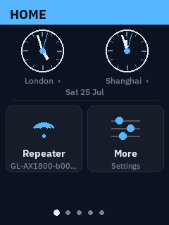
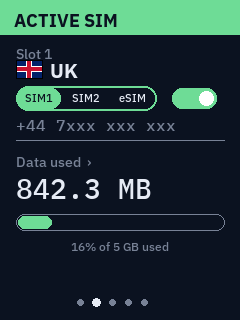
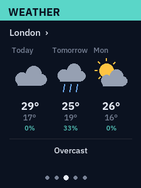
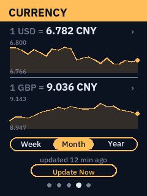
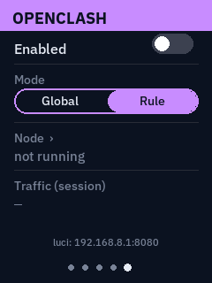
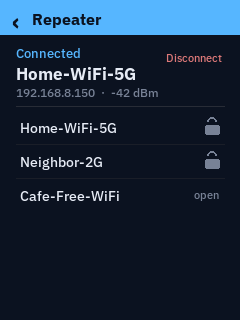
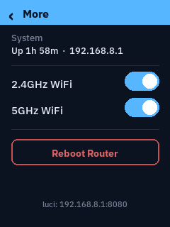
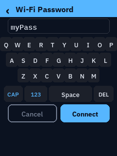

# GL-E5800 Touch Dashboard

A custom, fully interactive replacement for the stock `gl_screen` UI on the
GL.iNet GL-E5800's built-in 240x320 touchscreen. Swipe between five panels,
tap into any of them for detail or control, and manage the router without
ever opening the web UI.



No image assets, no external UI framework — every icon, chart, and widget
is drawn at runtime with Pillow directly onto the framebuffer (`/dev/fb0`,
RGB565). Pure Python, ~2000 lines, one file.

## Panels

| Home | Active SIM | Weather |
|---|---|---|
|  |  |  |

| Currency | OpenClash |
|---|---|
|  |  |

**Home** — two small analog clocks (independently pickable cities/timezones),
today's date, and two tiles: **Repeater** and **More**, so you never need
the stock GL.iNet home page.

**Active SIM** — country flag, full number, a SIM1 / SIM2 / eSIM switch, a
cellular data on/off toggle, and a data-usage bar against a cap you set.

**Weather** — 3-day forecast (hand-drawn icons: sun/cloud/rain/snow/fog/storm)
for a city you pick from a curated list.

**Currency** — live rate for two currencies of your choice against CNY, each
with a real historical line chart (week/month/year, pulled from
[Frankfurter](https://frankfurter.dev), ECB reference rates).

**OpenClash** — on/off, Global/Rule mode, current node (flag + guessed
country from the node name) with a tap-to-switch node list, and session
traffic — all read from Mihomo's local REST API. Gracefully shows "not
installed" instead of breaking if OpenClash isn't on the device.

| Repeater | More | On-screen keyboard |
|---|---|---|
|  |  |  |

**Repeater** (from the Home tile) — scans and lists nearby WiFi, connects to
open networks directly or opens the on-screen keyboard for a password.
Uses the same `ubus` `repeater` object the stock GL.iNet UI uses.

**More** (from the Home tile) — 2.4GHz/5GHz radio toggles, uptime/LAN IP,
and a confirm-gated reboot.

**On-screen keyboard** — built because this screen has no physical or
pop-up keyboard. Two layers (letters/symbols), persistent caps toggle.

## Interaction

- **Swipe** left/right between the 5 main panels — real finger-tracking with
  an eased iOS-style snap/cancel animation, not a hard cut.
- **Tap** into a panel for detail screens (pick a city, pick a currency, set
  a data cap, configure OpenClash's node, etc). Tap the header or swipe
  right to go back.
- **Triple-press the power button** to switch between this dashboard and the
  stock GL.iNet screen at any time (round-trip tested at ~0.3-1.5s).
- **Single-press the power button** to sleep/wake the screen — real
  backlight control, not a fake black frame. (Disambiguated from the
  triple-press by waiting 0.6s of silence after the last press before
  acting, so a triple-tap doesn't also fire the single-press action.)

## Requirements

Built and tested specifically on a **GL.iNet GL-E5800**, OpenWrt 23.05.4,
GL firmware 4.8.x. It depends on hardware/paths specific to this model:

- 240x320 RGB565 framebuffer at `/dev/fb0`
- Capacitive touchscreen at `/dev/input/event0` (Multitouch protocol B)
- Power key at `/dev/input/event1` (`KEY_POWER`)
- Backlight control at `/sys/class/backlight/soc:backlight/brightness`
- GL.iNet's `repeater` and `cellular.*` ubus objects

It will very likely **not** work unmodified on other GL.iNet models — the
touch/framebuffer/backlight paths would need re-verifying (see
[Adapting to another model](#adapting-to-another-model) below). It should be
safe to try, though: the install keeps the stock `gl_screen` UI installed
and switchable back at any time (see [Uninstalling](#uninstalling)).

## Installation

**Fast path:** clone this repo on a machine that can SSH to the router, then
`./install.sh [router-ip]` (default `192.168.8.1`). It does everything in
steps 1-3 below. Read on for what it's actually doing, or to do it by hand.

SSH into the router as root, then:

```sh
# 1. Dependencies (from GL.iNet's own opkg feed)
opkg update
opkg install python3 python3-numpy zoneinfo-europe zoneinfo-asia
# python3-pillow conflicts with a file gl-sdk4-screen-large already owns
# (a bundled libfreetype) -- --nodeps works because that file is already
# on disk, just owned by the other package.
opkg install --nodeps python3-pillow
opkg install libtiff6

# 2. Copy the files (from your machine, adjust the path to wherever you
#    cloned this repo)
scp -O src/*.py src/*.sh root@192.168.8.1:/root/dashboard/
scp -O init.d/* root@192.168.8.1:/etc/init.d/

# 3. On the router: permissions + services
ssh root@192.168.8.1
chmod +x /root/dashboard/*.py /root/dashboard/*.sh /etc/init.d/citydash /etc/init.d/homebutton
/etc/init.d/homebutton enable
/etc/init.d/homebutton start

# 4. Preview before committing to it (renders to PNGs, doesn't touch the
#    live screen)
python3 /root/dashboard/dashboard.py --preview /root/dashboard/preview
# pull /root/dashboard/preview/*.png back and eyeball them

# 5. Go live
/root/dashboard/toggle.sh on
```

`toggle.sh on` disables the stock `gl_screen` service and enables/starts
`citydash` — the choice persists across reboots (mutually exclusive
enable flags), and there's a 3-strikes crash guard in `run.sh` that
automatically restores the stock UI if the Python process dies repeatedly,
so a bug can't permanently blank the screen.

### Uninstalling

```sh
/root/dashboard/toggle.sh off
/etc/init.d/homebutton stop
/etc/init.d/homebutton disable
rm -rf /root/dashboard /etc/init.d/citydash /etc/init.d/homebutton
```

## Configuration

There's no settings UI for these — edit directly:

- **Cities offered for Clock/Weather pickers**: `CITIES` / `WEATHER_CITIES`
  lists near the top of `dashboard.py` (need an IANA timezone name and, for
  weather, lat/lon — no geocoding, no free-text search, since there's no
  keyboard for it outside the WiFi-password flow).
- **Currencies offered**: `CURRENCIES` list.
- **Data cap presets**: `DATA_CAP_PRESETS`.
- User's actual picks (which city/currency/cap) persist at
  `/root/dashboard/config.json`, separate from the source.

## Known limitations

- **SIM2 vs eSIM**: this hardware shares one physical slot (slot 2) between
  a physical nano-SIM and the eSIM profile. There's no confirmed-safe
  documented `ubus` call to distinguish "activate eSIM profile" from
  "activate physical SIM2" specifically — both buttons currently just
  reorder modem slot priority to prefer slot 2. If you rely on eSIM
  specifically, verify this does what you expect before trusting it.
- **OpenClash node country** is guessed by keyword-matching the node's
  display name (`UK`, `Japan`, `HK`, ...) — accuracy depends entirely on
  your subscription's naming convention. No live GeoIP lookup.
- **Repeater scan is slow** (~5-8s on this hardware, `ubus call repeater
  scan '{"cached":true}'` is not actually fast despite the flag name) — it
  runs in a background thread so the UI doesn't freeze, but the network
  list takes a few seconds to populate after opening the Repeater screen.
- Fonts on this firmware (`/etc/gl_screen/language/ttf/`) render `‹ › ✓`
  fine but silently box unsupported Unicode (confirmed failures: `⇧ ⌫ 🔒`).
  Anything beyond plain ASCII + those three marks is drawn as a small PIL
  icon rather than assumed to render as text — see `_icon_lock`,
  `_icon_wifi_signal`, `draw_analog_clock` for the pattern if you add UI.

## Adapting to another model

The parts of this code that are GL-E5800-specific are isolated at the top
of `dashboard.py` and in `button_watch.py`:

- `W, H` and the RGB565 packing in `to_rgb565_bytes` — check your model's
  actual framebuffer size/format (`cat /sys/class/graphics/fb0/virtual_size`,
  `.../bits_per_pixel`).
- `TOUCH_DEV` and the multitouch event codes in `_touch_reader` — capture
  raw events while touching the screen to confirm your model reports the
  same protocol (see the calibration approach described in this repo's
  companion write-up, or just `cat /dev/input/eventN | xxd` while tapping).
- `BACKLIGHT_PATH` in `dashboard.py` and `screen_sleep.sh` — check
  `/sys/class/backlight/*/brightness` exists on your model.
- `DEV = "/dev/input/event1"` / `KEY_POWER` in `button_watch.py` — confirm
  which event node your model's power key reports on.

If your GL.iNet model doesn't have a `repeater` or `cellular.*` ubus object,
the Repeater tile and Active SIM panel will need adjusting or removing.

## License

MIT — see [LICENSE](LICENSE).
